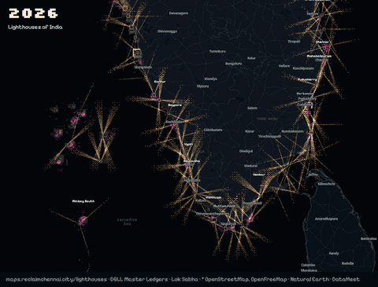
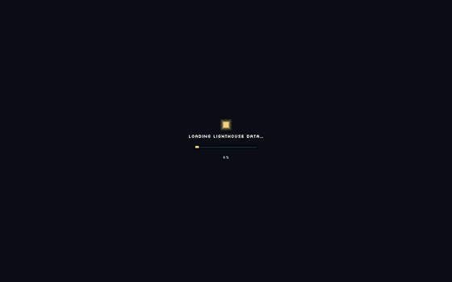
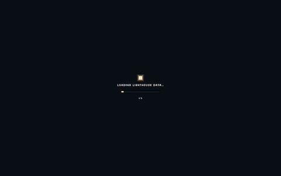

# Lighthouses of India

Every active light run by India's **Directorate General of Lighthouses & Lightships (DGLL)**:
its position, flashing rhythm, range, optic, tower, equipment, public access and linked tenders,
as open data, with the animated map that draws it.

**Live map:** https://maps.reclaimchennai.city/lighthouses/ &nbsp;·&nbsp; **Data:** [`data/`](data/) &nbsp;·&nbsp; **Large files:** [Releases](https://github.com/reclaimchennai/lighthouses/releases)



- **202 stations**: 199 lighthouses, the Perigee light vessel and 2 DGPS stations (200 active lights)
- **7 NAVTEX** coast radio stations with their UTC broadcast slots, **63 RACON** radar beacons with Morse identifiers
- **378 DGLL tenders** transcribed, 400 tender documents mirrored, 132 stations linked to their tenders
- Lighthouse funding allocated and used by year, from Lok Sabha answers
- Positions checked against OpenStreetMap, Wikidata and the Lighthouse Directory; every correction is logged

## What the map shows

| | |
|---|---|
|  |  |
| **Find a lighthouse.** Search by name; the card shows the DGLL photo, ranges, optic, equipment, tower and a link to its Master Ledger PDF. | **History.** Play the coast lighting up from 1796; the camera follows each light as it is lit. |
|  |  |
| **Colour by** light colour, equipment (NAVTEX, RACON, light only), age, or public access. | **NAVTEX and RACON.** Wavefronts brighten during each station's real UTC slot; RACON rings carry the beacon's Morse letter. |
|  |  |
| **Regions.** Jump to the east and west coasts, Chennai, Lakshadweep, Andaman & Nicobar. | **Night voyage.** A camera tour along the coast, light by light. |

More views: [Chennai's beam](media/chennai-beams.gif) · [Chennai and Pulicat RACON rings](media/chennai-racon.gif) ·
[Chennai in 3D](media/chennai-3d-city.gif) · [West coast towers](media/west-coast-towers.gif) ·
[NAVTEX and RACON in the south](media/navtex-racon-south.gif) · [Legend](media/legend-overview.gif) ·
[Oyster Rock with 3D buildings](media/oyster-rock-3d.gif). Full-length videos are in the release.

How it is drawn:

- Each light flashes its **real characteristic**, taken from DGLL's itemised light and eclipse timings
  (Chennai: `0.57+1.93+0.57+6.93` s). Revolving optics are drawn as sweeping beams, delayed by bearing so
  every point at sea sees the published rhythm.
- **Reach** is sea-only: the shorter of luminous range and geographical range (5 m eye height), and sight
  lines stop at the first landfall, so headlands and islands cast shadows.
- **3D towers** are built from each ledger's tower type, height and colours.
- **3D scans** (Gaussian splats) of lighthouses with enough public photos: see [3D scans](#3d-scans).

## Data

All files are in [`data/`](data/). Coordinates are **WGS 84 (EPSG:4326)** decimal degrees. In CSV files, list and
object fields are JSON text. `scripts/export_data.py` regenerates everything here from the site build.

| File | Rows | What |
|---|---:|---|
| [`lighthouses.csv`](data/lighthouses.csv) · [`.geojson`](data/lighthouses.geojson) · [`.kml`](data/lighthouses.kml) | 202 | Every station, 65 columns (below) |
| [`lighthouses.gpkg`](data/lighthouses.gpkg) | | GeoPackage with layers `lighthouses`, `navtex`, `racons` (QGIS, ArcGIS) |
| [`navtex.csv`](data/navtex.csv) · [`.geojson`](data/navtex.geojson) | 7 | NAVTEX stations, identifiers and broadcast slots |
| [`racons.csv`](data/racons.csv) · [`.geojson`](data/racons.geojson) | 63 | RACON radar beacons |
| [`tenders.csv`](data/tenders.csv) | 378 | DGLL tenders, transcribed |
| [`budget.csv`](data/budget.csv) · [`parliament.json`](data/parliament.json) | 3 | Funds allocated and used, from Lok Sabha answers |
| [`photos.csv`](data/photos.csv) | 188 | Station photo archive: source, credit, size, checksum |
| [`light_audit.csv`](data/light_audit.csv) | 202 | How each light's rhythm and beam were derived, with flags |
| [`web/data/ledgers/`](web/data/ledgers/) | 200 | Full Master Ledger transcription per station (JSON) |

Quick start:

```python
import pandas as pd
lights = pd.read_csv("https://raw.githubusercontent.com/reclaimchennai/lighthouses/main/data/lighthouses.csv")
lights[lights.visit == "open"][["name", "lat", "lon", "established", "tower_h_m"]]
```

### `lighthouses.csv` columns

**Identity and position**

| Column | Meaning |
|---|---|
| `id` | Stable id, from the DGLL page slug (e.g. `chennai-lighthouse`); also the map link `…/lighthouses/#chennai-lighthouse` |
| `name` | Name as DGLL writes it |
| `kind` | `lighthouse`, `lightvessel` or `dgps` |
| `region` | DGLL directorate (Chennai, Kochi, Mumbai, Port Blair, …) |
| `lat`, `lon` | Position, WGS 84 |
| `pos_src` | Where the position comes from: `DGLL ledger`, or the correction used (OpenStreetMap element, Lighthouse Directory) |
| `address` | Postal address from DGLL |

**Light**

| Column | Meaning |
|---|---|
| `alol` | Admiralty List of Lights number |
| `char` | Characteristic as printed in the ledger |
| `ckind` | Characteristic type: `Fl` flashing, `Oc` occulting |
| `colour` | `W` white, `R` red, `G` green |
| `group` | Flashes per group |
| `period` | Period in seconds |
| `phases` | Light and eclipse durations in seconds, in order, e.g. `[0.57, 1.93, 0.57, 6.93]` |
| `phases_src` | `ledger` (itemised timings) or `derived` (from the characteristic) |
| `flash_s` | Flash length in seconds |
| `sectored`, `sectors_text` | Whether the light shows sectors, and the ledger's sector text |
| `lum_nm` | Luminous range, nautical miles (ledger) |
| `geo_nm` | Geographical range, nautical miles, for a 5 m eye height |
| `iala_nm` | Luminous range computed from the ledger intensity (IALA E-200-2), as a cross-check |
| `reach_nm` | Range drawn on the map: the shorter of luminous and geographical range |
| `intensity_cd` | Light intensity, candela |
| `elev_m` | Focal plane height above sea level, metres |

**Optic and equipment**

| Column | Meaning |
|---|---|
| `optic` | `revolving` (rotating beam) or `flasher` (flashes in place) |
| `optic_order` | Fresnel lens order, where stated |
| `optic_evidence` | Ledger text the optic type was read from |
| `optic_make`, `optic_model`, `optic_type`, `optic_size` | Optic details from the ledger |
| `rpm`, `panels`, `panels_total`, `panels_note` | Rotation speed and lens panels, for revolving optics |
| `led`, `solar` | LED light source; solar powered |
| `ais`, `dgps`, `racon`, `navtex`, `vts` | Other aids at the station (RACON Morse code, NAVTEX identifier where present) |
| `equip_years`, `equip_since` | Year each piece of equipment was installed, where known |

**Tower, history and access**

| Column | Meaning |
|---|---|
| `tower_type`, `tower_h_m`, `tower_colour` | Tower construction, height in metres, and paint scheme |
| `tower_year` | Year the present tower was built |
| `established` | Year the station was first lit |
| `visit` | Public access: `open` (tower open to visitors), `grounds` (grounds only), `closed`; blank where not stated |
| `tourism`, `museum` | Developed for lighthouse tourism; has a museum |

**Sources and links**

| Column | Meaning |
|---|---|
| `record` | Counted as an active light (`false` for the two DGPS-only stations) |
| `transcribed`, `no_ledger`, `ledger_issues` | Ledger transcribed; no ledger published; problems found in the ledger (typos, contradictions) |
| `ledger_url` | DGLL Master Ledger PDF |
| `page_url` | DGLL station page |
| `rowlett` | Lighthouse Directory (Russ Rowlett) entry text |
| `arlhs` | ARLHS World List of Lights number |
| `wikidata` | Wikidata item |
| `photo`, `photo_credit` | Station photo URL and credit |
| `tenders` | Ids (`nid`) of linked tenders in `tenders.csv` |

### Other files

- **`navtex.csv`**: `name`, `station` (id in `lighthouses.csv`), `lat`, `lon`, `id_518` / `id_490` (NAVTEX letter on 518 kHz
  international and 490 kHz national), `slots_518` / `slots_490` (UTC start times, HHMM, each a 10-minute window), `since`.
- **`racons.csv`**: `name`, `code` (Morse identifier), `station`, `lat`, `lon`, `pos_src`. Four offshore platform beacons
  have no station; their positions are parsed from the DGLL name (`pos_src = parsed from the DGLL name`).
- **`tenders.csv`**: `nid` (DGLL tender id), `title`, `directorate`, `region`, `category`, `procurement`, `start`, `end`,
  `bid_opening`, `summary`, `scope`, `money` (estimated cost, EMD, fees in INR), `period`, `dates`, `eligibility`, `specs`,
  `corrigenda`, `sites` (stations the work is for), `confidence` and `notes` (transcription quality), `listing_url`, `docs`.
- **`budget.csv`**: `year`, `allocation`, `utilisation` (₹ crore), `note`, `source` (Lok Sabha question).
- **`photos.csv`**: `station`, `src` (original URL), `credit`, `width`, `height`, `bytes`, `sha256`.

## Releases

Files too large for the repository are attached to [releases](https://github.com/reclaimchennai/lighthouses/releases), as in
[chennai-swd](https://github.com/reclaimchennai/chennai-swd/releases):

| Asset | What |
|---|---|
| `dgll_master_ledgers_pdf.zip` | DGLL Master Ledger PDFs for every station, as published |
| `dgll_tender_documents.zip` | The mirrored DGLL tender documents (NIT, BOQ, corrigenda) |
| `station_photos_original.zip` | Original station photos (DGLL and Wikimedia Commons; see `data/photos.csv`) |
| `basemap_sources.zip` | Natural Earth and DataMeet layers used to build the basemap and land mask |
| `map_recordings_mp4.zip` | Full-length screen recordings of the map |
| `mahabalipuram-lighthouse.sog`, `.ply` | 3D scan of Mahabalipuram lighthouse and its photo attribution |

## 3D scans

A scan needs many overlapping photos of one tower. `scripts/splat/` gathers them from Wikimedia Commons with their
authors and licences, finds camera positions with COLMAP and trains a Gaussian splat with OpenSplat on a GPU, then
compresses it to SOG for the web. On a Mac without Xcode, apply `scripts/splat/opensplat-mps-without-xcode.patch` to
OpenSplat so Metal kernels compile at runtime. See [`scripts/splat/README.md`](scripts/splat/README.md).

A splat built from Commons photos is a derivative work: each scan ships with its `attribution.json`, and keeps the
photos' licence (mostly CC BY-SA).

## Build it yourself

```bash
scripts/fetch_sources.sh      # DGLL pages and ledger PDFs, Lighthouse Directory, OpenStreetMap, Wikidata, Lok Sabha
scripts/refresh.sh            # parse ledgers, merge, check positions, compute reach, attach photos and tenders
python3 scripts/export_data.py
```

| Step | Script | Output |
|---|---|---|
| Basemap and land mask | `build_basemap.py` | `web/data/basemap.json`, `build/land_mask.geojson` |
| Master Ledgers | `parse_ledgers.py` | `build/ledgers.json`, `web/data/ledgers/` |
| Lighthouse Directory | `parse_rowlett.py` | `build/rowlett.json` |
| Merge, position QA, sea-only reach | `build_data.py` | `web/data/lighthouses.json`, `web/data/reach.json` |
| Photos | `fetch_photos.py` | `build/photos.json` |
| Tenders | `fetch_tenders.py`, `prep_tenders.py`, `link_tenders.py` | `web/data/tenders.json` |
| Open data | `export_data.py` | `data/` |

`build/build_notes.txt` logs every position correction and skipped station. `ARCHITECTURE.md` explains the data
decisions and how the map is drawn.

```
lighthouses/
├── data/        open data exports (CSV, GeoJSON, KML, GeoPackage)
├── web/         the site: index.html, js/, css/, data/ (including per-station ledger JSON)
├── scripts/     fetch, parse, build, export; splat/ for 3D scans
├── build/       intermediates: ledger and tender transcriptions, build notes
├── raw/         fetched sources (DGLL pages, Lighthouse Directory, OSM, Wikidata, Lok Sabha)
└── media/       GIFs of the map
```

## Sources and credits

| Source | Used for | Terms |
|---|---|---|
| [DGLL](https://www.dgll.nic.in) station pages, Master Ledgers, tenders, NAVTEX and RACON lists | Everything about each light | Government of India publication |
| [Lok Sabha](https://sansad.in) unstarred questions 949 and 3233 | Funding, public access and museums | Parliament of India |
| [Lighthouse Directory](https://www.ibiblio.org/lighthouse/) (Russ Rowlett) | History, position checks | Linked and quoted per entry |
| [OpenStreetMap](https://www.openstreetmap.org/copyright) seamarks and buildings | Position checks, 3D buildings | © OpenStreetMap contributors, ODbL |
| [Wikidata](https://www.wikidata.org) | ARLHS numbers, positions | CC0 |
| [Wikimedia Commons](https://commons.wikimedia.org) | Photos, 3D scan photos | Per file, listed in `photos.csv` and `attribution.json` |
| [Natural Earth](https://www.naturalearthdata.com), [DataMeet](https://github.com/datameet/maps) | Basemap, land mask | Public domain; DataMeet terms |
| [OpenFreeMap](https://openfreemap.org) / OpenMapTiles | Place labels and roads | © OpenMapTiles, © OpenStreetMap contributors |
| [pixelarticons](https://pixelarticons.com) | Icons | MIT |

Positions, characteristics and equipment are transcribed from public documents and may contain errors. They are
not for navigation: use official charts and Notices to Mariners. Corrections are welcome as
[issues](https://github.com/reclaimchennai/lighthouses/issues).

Made by [Reclaim Chennai](https://github.com/reclaimchennai).
